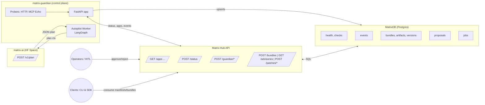
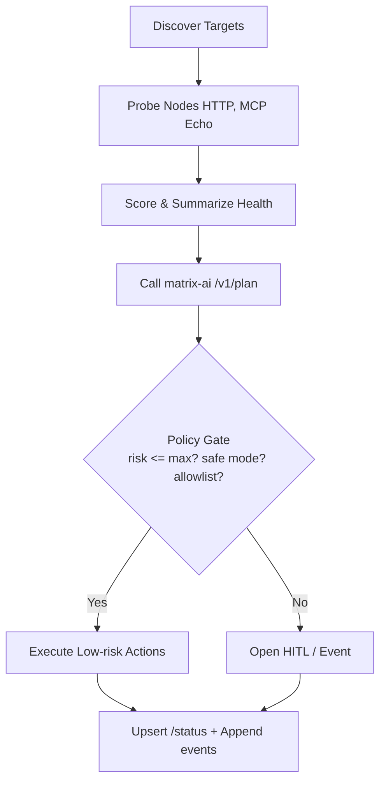
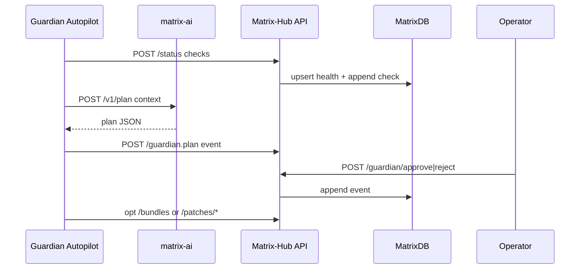

# matrix-guardian

**matrix-guardian** is the AI control plane for the Matrix EcoSystem. It observes the health of MCP servers, proposes safe remediation plans using **matrix-ai**, and (by default) pauses for **human-in-the-loop (HITL)** approval. A new **Autopilot** mode (multi-agent, LangGraph-based) lets you run supervised autonomy with strict policy gates.

---

## What’s new

* **Autopilot (optional):** Multi-agent LangGraph orchestrator with policy guardrails.
* **Service clients:** Thin, retrying clients for **matrix-ai** (`/v1/plan`) and **matrix-hub** (`/apps`, `/status`, etc.).
* **Probers:** Safe HTTP probe and optional MCP echo handshake.
* **Worker:** Headless loop runner for the Autopilot; can run as a sidecar/container/cron.
* **Router:** Optional REST to toggle Autopilot and read status (feature-flagged).
* **Configs:** New `AUTOPILOT_*` environment flags and YAML policy file support.

All additions are **additive**: no breaking changes to existing APIs or runtime.

---

## High-level architecture



### Autopilot decision pipeline



### Sequence (runtime)



---

## Quick start

### 1) Local development

```bash
# Create venv and install
make dev

# Copy envs and edit
cp configs/.env.example .env
# Set DATABASE_URL, MATRIXHUB_API_BASE, MATRIX_AI_BASE, API_TOKEN

# Run the FastAPI server
make run
# Liveness
curl -s http://localhost:8000/healthz
```

### 2) Docker Compose

```bash
docker compose -f infra/docker/compose.yaml up --build
```

> Optionally run the headless Autopilot worker in its own container (see Compose notes below).

---

## Configuration

Configuration is loaded from `configs/settings.yaml` and can be overridden by environment variables (e.g., `.env`).

**Required**

* `DATABASE_URL` — Postgres URL for guardian state/checkpointing
* `MATRIXHUB_API_BASE` — Base URL for Matrix-Hub
* `MATRIX_AI_BASE` — Base URL for matrix-ai
* `API_TOKEN` — Bearer token (if hub requires it)

**Autopilot (new)**

* `AUTOPILOT_ENABLED` — `true|false` (default: `false`)
* `AUTOPILOT_API_ENABLED` — expose REST control endpoints (default: `false`)
* `AUTOPILOT_INTERVAL_SEC` — loop interval (default: `60`)
* `AUTOPILOT_POLICY` — path to YAML policy (default: `src/guardian/agents/policies/default_policy.yaml`)
* `AUTOPILOT_SAFE_MODE` — constrain actions to non-destructive set (default: `true`)

See `src/guardian/autopilot_settings.py` and `src/guardian/config.py` for full options.

---

## Endpoints

Base service (always-on):

* `GET /healthz` — liveness
* `GET /readyz` — readiness (db ping)
* `POST /threads/{thread_id}/resume` — HITL resume façade (LangGraph checks)

Autopilot router (feature-flagged via `AUTOPILOT_API_ENABLED=true`):

* `GET /autopilot/status` — current mode and last cycle summary
* `POST /autopilot/enable` — enable Autopilot (in-process flag)
* `POST /autopilot/disable` — disable Autopilot

> All endpoints emit JSON logs; consider setting `LOG_LEVEL=DEBUG` for troubleshooting.

---

## Directory layout (key parts)

```
src/guardian/
  app/
    api.py
    routes/
      health.py
      resume.py
      autopilot.py            # (feature-flagged) on/off/status
  agents/
    autopilot.py              # Orchestrator (LangGraph)
    graph.py                  # Graph assembly (nodes/edges)
    policy.py                 # Policy gate (risk, allowlist, safe mode)
    policies/
      default_policy.yaml
    tools/
      http_probe.py
      mcp_echo.py
  services/
    matrix_ai_client.py       # Calls matrix-ai /v1/plan
    matrix_hub_client.py      # Calls matrix-hub
    jobs.py                   # (optional) visibility/queue against DB 'jobs'
  runner/
    autopilot_worker.py       # Headless loop worker
  autopilot_settings.py       # Pydantic settings
```

---

## Running Autopilot

### A) As a local process

```bash
# One-off cycle
python -m guardian.runner.autopilot_worker

# or using Make
make run-autopilot
```

### B) As a container/sidecar

Add a service (example) to `infra/docker/compose.yaml`:

```yaml
  autopilot_worker:
    build:
      context: ../..
      dockerfile: infra/docker/Dockerfile
    command: ["python", "-m", "guardian.runner.autopilot_worker"]
    environment:
      - AUTOPILOT_ENABLED=true
      - AUTOPILOT_INTERVAL_SEC=60
      - AUTOPILOT_POLICY=src/guardian/agents/policies/default_policy.yaml
      - AUTOPILOT_SAFE_MODE=true
      - DATABASE_URL=${DATABASE_URL}
      - MATRIXHUB_API_BASE=${MATRIXHUB_API_BASE}
      - MATRIX_AI_BASE=${MATRIX_AI_BASE}
      - API_TOKEN=${API_TOKEN}
    depends_on:
      db:
        condition: service_healthy
```

---

## Safety defaults

* **Sandbox first:** probes run with short timeouts, low conn limits, and strict host allowlists.
* **HTTP client:** retries with exponential backoff; low timeouts by default.
* **Plan intake:** plans from `matrix-ai` are strictly validated against a Pydantic schema; fallbacks are applied on malformed outputs.
* **Policy gate:** every action flows through `policy.py` (risk thresholds, allowlists, safe-mode checks). HITL remains the default.
* **Auditability:** all impactful operations append events to Matrix-Hub/DB; idempotency keys are honored where applicable on the hub.

---

## Observability & audit

* **Structured JSON logs** with request correlation.
* **Events:** guardian emits `events` to Matrix-Hub for plan proposals, approvals, rejections, and automation outcomes.
* **ETags & Idempotency:** hub reads are cache-friendly; writes are safe to retry.

---

## Testing

A minimal smoke test is provided:

```bash
pytest -q tests/test_autopilot_smoke.py -q
```

---

## Backwards compatibility

This repository remains **Stage-1 compatible**:

* If `AUTOPILOT_ENABLED=false` (default), guardian behaves as the prior HITL-only control plane.
* All new modules are optional and feature-flagged; existing endpoints are unchanged.

---

## License

Apache-2.0 (see `LICENSE`).
